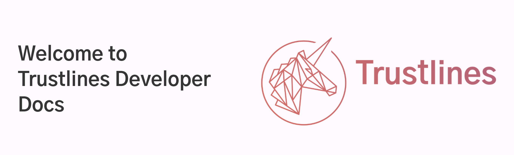

# Trustlines Developer Docs

___

Trustlines Developer Docs will contain all the technical documentation related to [Trustlines Protocol](https://trustlines.foundation/protocol.html).

Here you can find all kind of technical details about Trustlines as well as code related documentation.

This site is a work in progress and the documentation currently resides in their respective repositories of the [trustlines-protocol GitHub organization](https://github.com/trustlines-protocol/).

### Content

- **Blockchain**

> The Trustlines Blockchain is a minimal viable Proof-of-Stake (mPoS) Ethereum sidechain.

- **Client library**

> The clientlib is a JS-library which makes it easy to build applications on top of the Trustlines Protocol. It provides a high level API to enable applications to interact with the smart contract system on the blockchain via the relay servers.

- **Relay Servers**

> The Relay Servers are an optional bridge between client apps and the Trustlines blockchain. They offer services which are not feasible to be implemented on-chain or within the client apps. Importantly, Relay servers calculate optimal paths and relay transactions.

- **Smart Contract System**

> The smart contract system is a collection of solidity contracts deployed on the Trustlines Blockchain. Transfers within the Trustlines Network are executed by the smart contracts. All trustlines (i.e. credit lines and balances between users) are notarized on the Trustlines Blockchain. Furthermore, the smart contracts enforce the rules determining how trustlines can be created, used and updated.

### Cloning the repository

If you are cloning the repo for the first time, you should run `git clone --recurse-submodules https://github.com/trustlines-protocol/tl-dev-docs.git`.

If you have already cloned the repo prior or forgot to add `--recurse-submodules` when cloning, you will want to `init` and `update` the submodules.

This can be done with a single command, `git submodule update --init --recursive` or individually with `git submodule init` and `git submodule update`.

**_Important note:_** The submodules do not update automatically with new commits made in the repos. You will need to run `git submodule update --remote` or simply do `git fetch` in the right submodule folder.

### Requirements and steps for running the site locally

#### Requirements

- [Ruby](https://www.ruby-lang.org/en/downloads/) version 2.4.0 or above, including all development headers (ruby version can be checked by running `ruby -v`)
- [RubyGems](https://rubygems.org/pages/download) (which you can check by running `gem -v`)
- [GCC](https://gcc.gnu.org/install/) and [Make](https://www.gnu.org/software/make/) (in case your system doesn’t have them installed, which you can check by running `gcc -v`, `g++ -v` and `make -v` in your system’s command line interface)
- [Jekyll](https://jekyllrb.com/) (currently using v4.0.0)

#### Steps to install locally

- [Install Ruby](https://www.ruby-lang.org/en/documentation/installation/)
- [Install Gem](https://rubygems.org/pages/download)
- [Install Jekyll](https://jekyllrb.com/docs/installation/)

#### Running locally
- `cd path-to-your-tl-dev-docs-folder/`
- Run `bundle exec jekyll serve`
- Open http://127.0.0.1:4000/ in your favourite browser
  - If you're running into a 404 Not found error, try setting `baseurl: ""` in the `_config.yml` file and run serve again.
