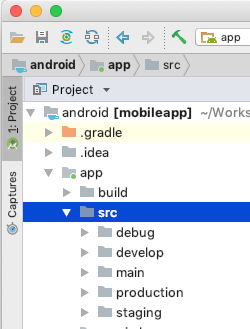

## General issues

* When trying to build the app via fastlane and this error occurs:
`[...]/android_gradle_build.json (No such file or directory)`
you have to open the app in Android Studio. While opening the project Android Studio does a sync and __refreshes linked c++ libraries__. This can also be triggered manually when Studio is open via `MainMenu > Build > Refresh Linked C++ Projects`

* If Android Studio refuses to sync successfully try invalidate caches and restart by navigating to `File` -> `Invalidate Caches/Restart`

## Build

As with the ios project, we have 3 different targets to build:

* develop
* staging
* production

Each target can be build in `debug` or `release` config:
> developDebug, stagingDebug, productionDebug, developRelease, stagingRelease and productionRelase

This is reflected in the androids projects src structure:



Whatever can be found in `debug` will be included in all Debug versions:
> developDebug, stagingDebug, productionDebug

Files in `staging` are included in
> stagingDebug, stagingRelease

and so on.

## React Native modules

:::note
The instructions here apply only to new modules. The modules/libraries already installed in the Trustlines app are correctly
linked and generally you shouldn't have to do any of the described actions below.
:::

Some React Native libraries often come with platform-specific (native) code. Since React Native 0.60 the native code
can be installed by a process called autolinking. Autolinking means that you as a developer don't have to do anything
else than `yarn install`. The rest is "automagically" taken care of. 

Some native libraries though still don't support auto-linking and because of that after installing a library 
that has native code you'll need to run `react-native link <packageName>` to install the native code. 

:::warning
__`react-native link` should not be called without the packages name!__
:::

After calling `react-native link <packageName>` react native modules are included in `<root>/settings.gradle` and `<root>/app/build.gradle`

To better illustrate this let's look at an example. At the time of writing the `react-native-safe-area-context` doesn't support
autolinking. If you install it with `yarn add react-native-safe-area-context` and afterwards run `react-native link react-native-safe-area-context` this will add the following code:

```java title="<root>/settings.gradle"
...
include ':react-native-safe-area-context'
project(':react-native-safe-area-context').projectDir = new File(rootProject.projectDir, '../node_modules/react-native-safe-area-context/android')
...
```
and  referenced in

```java title="<root>/app/build.gradle"
...
dependencies {
	...
	implementation project(':react-native-safe-area-context')
	...
}
...
```

How to completely integrate a native module might vary and usually is described in the modules repository description. Always recheck / diff your files for changes after you call `react-native link <packageName>` and if it reflects what you anticipated.

## Android Simulator
When running the application in the android simulator, you can not easily use the camera and interact with the app as you would do with a physical phone. You can send remote commands to the simulator though.
To open the QR code link to create a new trustline, you can start the VIEW intent, passing the URL copied from the QR code screen.

```adb shell am start -a "android.intent.action.VIEW" -d "<QR Code URL here>"```

This basically does the same as clicking the link inside the messages app.
