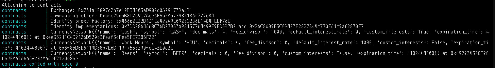
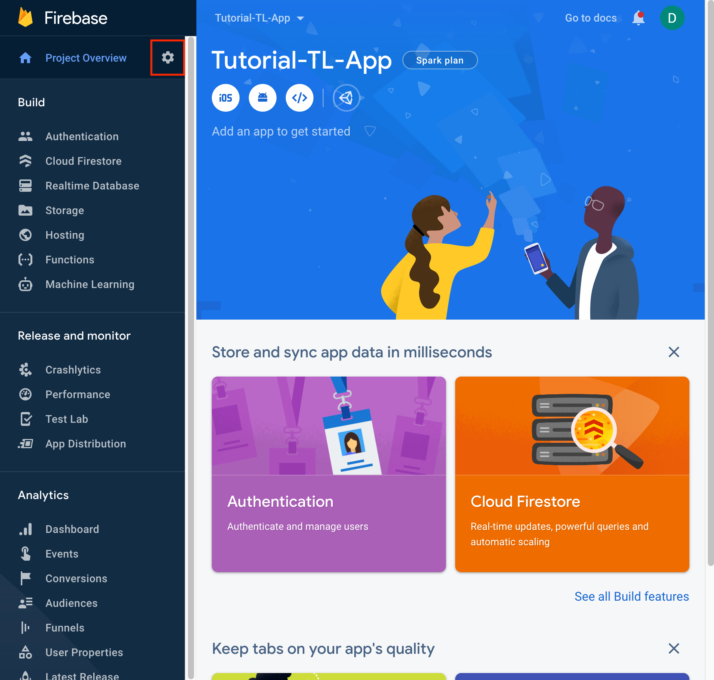
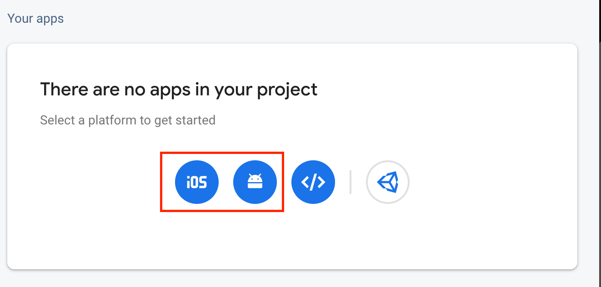

import Tabs from "@theme/Tabs"
import TabItem from "@theme/TabItem"

:::caution Prerequisites
In this tutorial we assume that you are comfortable working with [Docker](https://www.docker.com/), [Git](https://git-scm.com/)
and the Terminal. In addition to this you would need a [Firebase](https://firebase.google.com/) account and your dev. machine should be configured to work
with [React-Native](https://reactnative.dev) projects.
:::

:::warning
The tutorial was tested on a Mac. You should be able to run the Android version of the app on Linux or Windows, but some
things might be different.
:::

The Trustline app relies on a [Relay](/relay/introduction) server for its communication with the Trustlines blockchain (TLBC).
Especially at the beginning, when you just want to get started, it is a daunting task to set up everything.
In this tutorial we'll take a shortcut. Instead of setting up a Relay server that will communicate with the TLBC chain or with
the Laika test chain, we'll use a utility that the maintainers of the [Trustlines Protocol use for e2e tests](https://github.com/trustlines-protocol/end2end).

The tool in the end2end repository relies on Docker and sets the followings:

- A development OpenEthereum node that automatically mines a block when it receives a transaction
- A relay server
- A py-eth-index instance to index events for the relay
- A Postgres database
- A contracts docker image that will deploy test currency networks, exchanges, and identity contracts

:::info
By using the end2end utility you won't be sending transactions to the TLBC or Laika chains, but instead to a local
dev chain. This way you don't have to pay for transactions when you get started. At a later stage when you
move to production you'll have to properly configure your relay server to communicate with the TLBC chain.
:::

# Let's get started!

First, clone the end2end repository

```bash
git clone git@github.com:trustlines-protocol/end2end.git
```

Now go inside the created end2end repo

```bash
cd end2end
```

You could already try to run the `run-e2e.sh` script, but chances are that this will fail. The tool in the end2end
repo isn't versioned and running always from the HEAD of the master branch wouldn't always succeed. At the time of
writing this tutorial one couldn't successfully launch the relay server, so let us checkout a version of the end2end
library that we know works:

```bash
git checkout 287e769c536c2ea041a8ce4a05603a113aa124c5
```

Now start the relay with the following command

```bash
TL_INDEX_IMAGE=trustlines/py-eth-index:0.3.3 TL_RELAY_IMAGE=trustlines/relay:0.18.0 ./run-e2e.sh -b
```

:::note
We are starting the e2e script with the `-b` flag - this tells the script to start everything except for the e2e tests.
Also, note that we've set the `TL_INDEX_IMAGE` and `TL_RELAY_IMAGE` to a combination of versions we know are working at
the time of writing this.
:::

Once the script is ready you should see output similar to this:

[](./e2e_output_contracts.png)
[](./e2e_output.png)

Let's spend a few seconds to look over the output (you can click on the image to view it in full size).
The most important lines are:

````
Attaching to contracts
contracts | Exchange: 0x731a10897d267e19B34503aD902d0A29173Ba4B1
contracts | Unwrapping ether: 0xb4c79daB8f259C7Aee6E5b2Aa729821864227e84
contracts | Identity proxy factory: 0x46662E22D131Ea49249E0920C286E1484FEEf76E
contracts | Identity implementations: 0x3DD0864668C36D27B53a98137764c99F9FD5B7B2 and 0x26C8d09E5C0B423E2827844c770F61c9af2870E7
contracts | CurrencyNetwork({'name': 'Cash', 'symbol': 'CASH', 'decimals': 4, 'fee_divisor': 1000, 'default_interest_rate': 0, 'custom_interests': True, 'expiration_time': 4102444800}) at 0xee35211C4D9126D520bBfeaf3cFee5FE7B86F221
contracts | CurrencyNetwork({'name': 'Work Hours', 'symbol': 'HOU', 'decimals': 4, 'fee_divisor': 0, 'default_interest_rate': 1000, 'custom_interests': False, 'expiration_time': 4102444800}) at 0x3f85D0b6119B38b7E6B119F7550290fec4BE0e3c
contracts | CurrencyNetwork({'name': 'Beers', 'symbol': 'BEER', 'decimals': 0, 'fee_divisor': 0, 'custom_interests': False, 'expiration_time': 4102444800}) at 0x492934308E98b590A626666B703A6dDf2120e85e
contracts exited with code 0```
````

Notice the `Identity proxy factory` and `Identity implementations` addresses. You'll need them later for the .env config
of the app. The output also tells you that 3 currency networks were deployed `Cash`, `Work Hours` and `Beers`. Those
currency networks will be later available in the app once it is connected to the relay server.

Now let's configure the Trustlines App to use this backend.

Let's clone the Trustlines app

```bash
git clone git@github.com:trustlines-network/mobileapp.git
```

enter the trustlines app directory:

```bash
cd mobileapp
```

**Firebase**

Before you can install the developer dependencies you'll need to create a Firebase Project in the [firebase console](https://console.firebase.google.com)
Once ready you should see a screen similar to this one:


Click on the cog wheel to enter the project settings and create iOS and Android Apps there


:::warning
To make your experimentation easy when asked for iOS bundleID enter: `beercoin.io.mobileapp.develop` and for android
package name enter: `network.trustlines.mobileapp.develop.debug`. You won't be able to distribute the app you build
through the App/Play store with those ids, but that's not the goal here anyway. Once you experiment with the
Trustlines app and you are ready to distribute it through the App/play store you can create new apps in Firebase with the
correct bundle ID and package name.
:::

When creating the iOS app Firebase will offer the `GoogleService-Info.plist` file for download. Download it and store it
in the firebase/ios/\*\* folders.

When creating the Android app Firebase will offer the `google-services.json` file for download. Download it and store it
in the firebase/android/\*\* folders.

:::info
You might wonder: "Why do I need to store the firebase files in develop, staging and production folders?".
The answer is simple. By default the Trustlines App is configured to work in 3 modes - develop, staging and production.
You can specify different configurations for each of those modes. For simplicity, in this tutorial we'll reuse
the same config everywhere.
:::

Now that you've placed the firebase files in the correct folders, you can continue by initializing the dependencies. In the
terminal run:

<Tabs
    groupId="packager"
    defaultValue="yarn"
    values={[
        {label: 'npm', value: 'npm'},
        {label: 'Yarn', value: 'yarn'},
    ]}>
<TabItem value="npm">


```bash
npm i
```

</TabItem>
<TabItem value="yarn">


```bash
yarn
```

</TabItem>
</Tabs>


Once this is complete, if you plan to run the iOS version of the App you need to execute the following command:

```bash
cd ios && pod install && cd ..
```

This command will navigate to the ios folder, inside of it, it will call pod install and once the cocoapods installation is
complete, it will go back to the main mobileapp folder.

Now you need to modify some `.env` variables. In the mobileapp folder you should see an `.env.dist`
file, copy it and rename it to `.env.develop`. Now open the `.env.develop` file and you should see something like this:

```ini
RELAY_URL=https://staging.testnet.trustlines.network/api/v1
MESSAGING_URL=https://staging.testnet.trustlines.network/api/v1
WALLET_TYPE=WALLET_TYPE_IDENTITY
IDENTITY_FACTORY_ADDRESS=0x2862ac3efE938Ac6d2bd466Be4842a777818C473
IDENTITY_IMPLEMENTATION_ADDRESS=0xe14b9FF5ADeC66142F5a621Cd7BA7Ca84035d47c
CHAIN_ID=18548
UNIVERSAL_LINK_BASE_URL=https://link.trustlines.app
BLOCKSCOUT_URL=https://explore.laika.trustlines.foundation
ANDROID_PACKAGE_NAME=network.trustlines.mobileapp.staging
IOS_BUNDLE_ID=beercoin.io.mobileapp.staging
APP_STORE_ID=
DOMAIN_URI_PREFIX=https://trustlines.page.link
```

The distributed `.env.dist` connects the app to the Laika test chain. We need to change this. Change the `RELAY_URL` to
`http://localhost:5000/api/v1`
Remember the identity factory address that was output when you started the e2e script? Set it for `IDENTITY_FACTORY_ADDRESS`.
Set the `CHAIN_ID` to `17`.

Now you should be ready to Rock & Roll!

<Tabs
    groupId="packager"
    defaultValue="yarn"
    values={[
        {label: 'iOS', value: 'ios'},
        {label: 'Android', value: 'android'},
    ]}>
<TabItem value="ios">


If using npm run:

```bash
npm run start:ios:develop
```

if using Yarn run:

```bash
yarn start:ios:develop
```

</TabItem>
<TabItem value="android">


If using npm run:

```bash
npm run start:android:develop
```

if using Yarn run:

```bash
yarn start:android:develop
```

</TabItem>
</Tabs>


:::caution
If when you build the iOS app you get a `The following build commands failed: CopyPlistFile .../mobileapp-fmklahskitxufpgbffpdozahumyf/Build/Products/Release-iphonesimulator/mobileapp-develop.app/GoogleService-Info.plist .../mobileapp/ios/mobileapp/GoogleService-Info.plist`
error, just restart the build, and it should be fine.
:::
